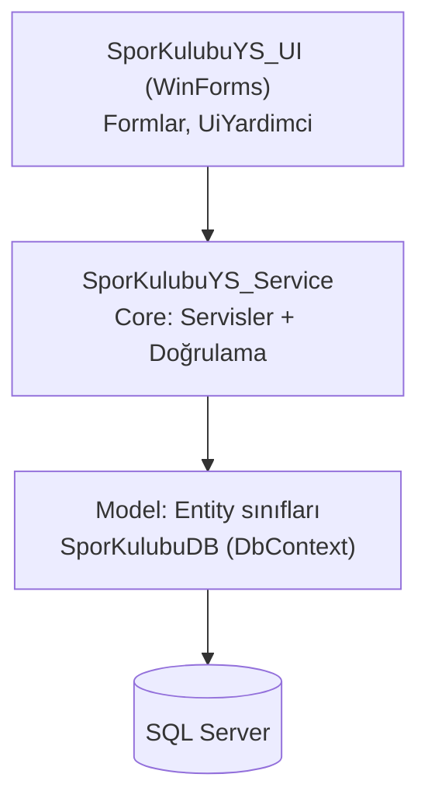
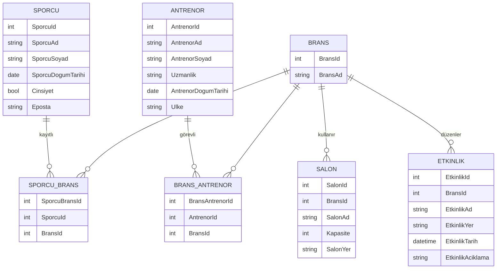

# Spor Kulübü Yönetim Sistemi

Bir spor kulübünün sporcularını, antrenörlerini, branşlarını, salonlarını ve etkinliklerini yöneten masaüstü uygulaması.
C# / .NET 8 / WinForms / **Entity Framework Core (Code-First)** / SQL Server.

   

---

## Özellikler

**Ana ekran**
- Özet kartları: sporcu, antrenör, branş ve yaklaşan etkinlik sayıları
- Yaklaşan ilk 10 etkinlik listesi; alt ekranlar kapanınca otomatik yenilenir

**Kayıt yönetimi (ekle / güncelle / sil / listele)**
- **Sporcular:** ad, soyad, doğum tarihi, cinsiyet, e-posta; kayıtlı olduğu branşlar listede görünür, ad/soyad/e-posta ile anlık arama
- **Antrenörler:** uzmanlık, ülke, doğum tarihi; görev yaptığı branşlar, arama
- **Branşlar:** her branşa bağlı sporcu, antrenör, salon ve etkinlik sayıları
- **Salonlar:** branş, kapasite, yer
- **Etkinlikler:** branş, tarih-saat, yer, açıklama; "sadece yaklaşanlar" filtresi, Yaklaşan/Geçmiş durumu

**Çoka-çok ilişkiler**
- Sporcuyu branşa kaydetme (bir sporcu birden fazla branşta olabilir)
- Antrenörü branşa atama (bir antrenör birden fazla branşta görev alabilir)

**İş kuralları ve doğrulama** (servis katmanında)
- Zorunlu alanlar ve veritabanındaki uzunluk sınırları kontrol edilir
- Ad/soyad sadece harf; e-posta formatı ve **benzersiz e-posta** kontrolü
- Yaş sınırları: sporcu 5–80, antrenör 18–80
- Aynı sporcu aynı branşa / aynı antrenör aynı branşa iki kez eklenemez
- Aynı isimde iki branş olamaz
- Geçmiş tarihe yeni etkinlik eklenemez; salon kapasitesi 1–10.000
- **Veri kaybı koruması:** bağlı sporcu, antrenör, salon veya etkinliği olan branş silinemez (veritabanındaki cascade silme yüzünden yanlışlıkla toplu silme olmasın diye)
- Silme işlemlerinde onay sorulur; sporcu/antrenör silinirken branş kayıtlarının da silineceği belirtilir

**Hata yönetimi**
- İş kuralı ihlalleri `KuralHatasi` olarak fırlatılır, kullanıcıya uyarı olarak gösterilir
- Beklenmeyen hatalarda program kapanmaz, anlaşılır bir mesaj gösterilir
- Veritabanına bağlanılamazsa açılışta ne yapılması gerektiği söylenir

---

## Mimari



| Katman | İçerik |
|---|---|
| `SporKulubu_YS/Model` | Entity sınıfları ve `SporKulubuDB` (DbContext) |
| `SporKulubu_YS/Migrations` | EF Core migration'ları (veritabanı şeması kodla yönetilir) |
| `SporKulubu_YS/Core` | Her varlık için servis arayüzü + sınıfı (`ISporcuService` / `SporcuService` …), `Dogrulama`, `KuralHatasi` |
| `SporKulubuYS_UI` | Formlar; ortak işler (`UiYardimci`: hata yakalama, tablo ayarları, ComboBox doldurma) |

**Akış:** Form → Servis (iş kuralları) → DbContext → SQL Server.
Formlar veritabanına doğrudan erişmez; tüm kurallar servis katmanındadır.

## Veri modeli



---

## Kurulum

**Gereksinimler:** Visual Studio 2022 (.NET 8 SDK), SQL Server Express

1. `SporKulubuYonetimSistemi.sln` dosyasını Visual Studio ile açın.
2. **SporKulubuYS_UI** başlangıç projesi olmalı (sağ tık → *Set as Startup Project*).
3. **F5** ile çalıştırın.

Veritabanını elle oluşturmanıza gerek yok: uygulama ilk açılışta `SporKulubuYS` veritabanını
oluşturur ve migration'ları uygular (`Database.Migrate()`).

SQL Server adınız farklıysa bağlantı cümlesini `SporKulubu_YS/Model/SporKulubuDB.cs` içinde değiştirin:

```csharp
public static string ConnectionString { get; set; } =
    @"Server=.\SQLEXPRESS;Database=SporKulubuYS;Trusted_Connection=True;TrustServerCertificate=True";
```

**Modelde değişiklik yaparsanız** (Package Manager Console, varsayılan proje: `SporKulubuYS_Service`):

```powershell
Add-Migration DegisiklikAdi
Update-Database
```

---

## Kullanılan teknolojiler

| Teknoloji | Amaç |
|---|---|
| .NET 8, WinForms | Masaüstü arayüz |
| Entity Framework Core 8 (SqlServer, Tools) | ORM, Code-First, migration'lar |
| SQL Server Express | Veritabanı |
| LINQ (`Include`, `ThenInclude`, projeksiyon) | Sorgular ve ilişkili veriyi yükleme |
